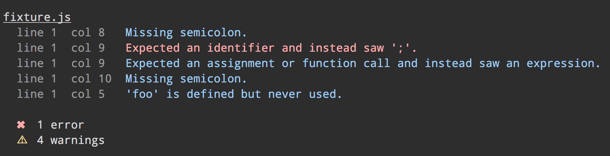
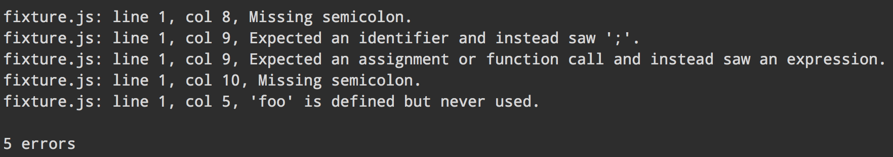

# jshint-more-stylish



Compared to the default reporter:




## Install

```
$ npm install --save-dev jshint-more-stylish
```

## Usage

### JSHint CLI

```
$ jshint --reporter=node_modules/jshint-more-stylish file.js
```

### [gulp-jshint](https://github.com/spalger/gulp-jshint)

```js
gulp.task('default', function () {
	gulp.src(['file.js'])
		.pipe(jshint('.jshintrc'))
		.pipe(jshint.reporter('jshint-more-stylish'));
});
```

### [grunt-contrib-jshint](https://github.com/gruntjs/grunt-contrib-jshint)

```js
grunt.initConfig({
	jshint: {
		options: {
			reporter: require('jshint-more-stylish')
		},
		target: ['file.js']
	}
});

grunt.loadNpmTasks('grunt-contrib-jshint');
grunt.registerTask('default', ['jshint']);
```
